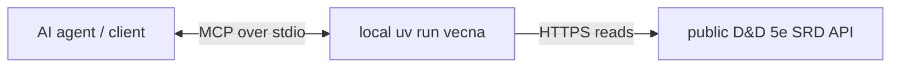
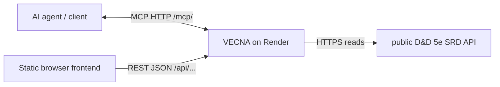
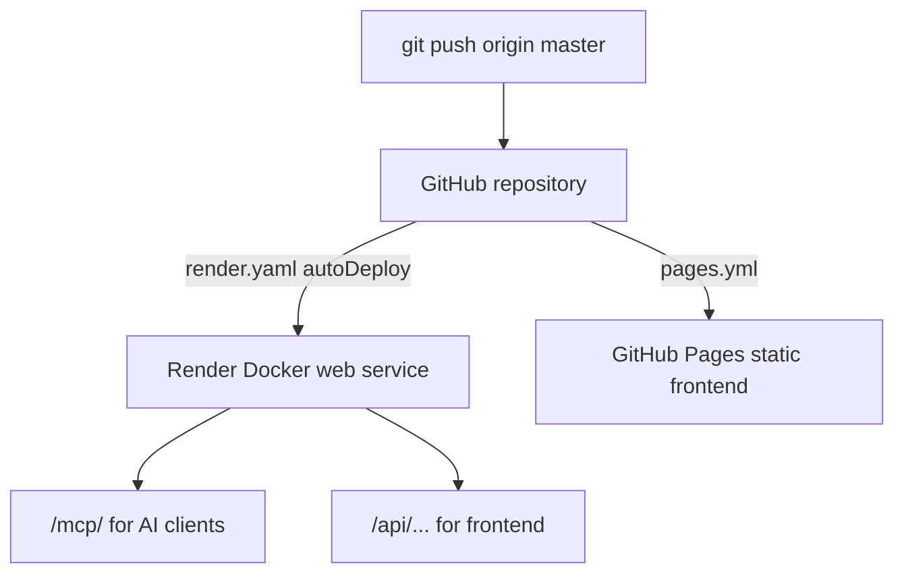

<div align="center">

# VECNA

**Vault Extensible Computational Nexus for Adventurers**

A D&D 5e SRD MCP server with tools, resources, prompts, dice rolling,
Streamable HTTP, and a static browser compendium.

[](https://www.python.org/)
[](https://modelcontextprotocol.io/)
[](https://docs.astral.sh/uv/)
[](https://vecna-svpo.onrender.com/api/health)
[](https://andreasmaurer0210.github.io/VECNA/)
[](#license)

[Live frontend](https://andreasmaurer0210.github.io/VECNA/) ·
[Remote MCP](https://vecna-svpo.onrender.com/mcp/) ·
[Health check](https://vecna-svpo.onrender.com/api/health) ·
[D&D 5e SRD API](https://www.dnd5eapi.co/)

</div>

---

## Contents

- [What VECNA does](#what-vecna-does)
- [Quick start](#quick-start)
- [Architecture](#architecture)
- [MCP and API configuration](#mcp-and-api-configuration)
- [Capabilities](#capabilities)
- [Deploy](#deploy)
- [Project map](#project-map)
- [Contributing notes](#contributing-notes)
- [README style references](#readme-style-references)
- [License](#license)

---

## What VECNA does

VECNA gives AI agents structured access to D&D 5e SRD data.

| Surface | Who uses it | Endpoint / command | What it gives |
|---------|-------------|--------------------|---------------|
| MCP stdio | Local agents | `uv run vecna` | Local tools/resources/prompts over stdin/stdout |
| MCP HTTP | Remote agents | `https://vecna-svpo.onrender.com/mcp/` | Network MCP access for OpenCode, Claude, etc. |
| REST API | Browser frontend | `/api/monsters`, `/api/spells`, `/api/classes` | JSON for the static compendium |
| Frontend | Humans | GitHub Pages | Search/browse monsters, spells, classes, dice |

Data source: [D&D 5e SRD API](https://www.dnd5eapi.co/) under `/api/2014`.

---

## Quick start

### 1. Install dependencies

```bash
uv sync
cp .env.example .env
```

### 2. Run local MCP over stdio

Use this when an AI client launches VECNA as a subprocess.

```bash
uv run vecna
```

### 3. Run local MCP + REST API over HTTP

Use this when testing `/mcp/`, `/api/...`, or the browser frontend.

```bash
VECNA_TRANSPORT=http VECNA_HOST=127.0.0.1 VECNA_PORT=8000 uv run vecna
curl http://localhost:8000/api/health
```

### 4. Run the frontend locally

```bash
python3 -m http.server 8080 --directory frontend
```

Open:

```text
http://localhost:8080/?server=http://localhost:8000
```

---

## Architecture

### Local MCP: agent starts VECNA directly



### Remote MCP + public REST API



### Hosted deployment path



Render free tier note: the service may sleep after idle time, but the URL stays stable.

---

## MCP and API configuration

MCP mode is configured in the AI client. Frontend REST mode is configured separately.

### Where each config lives

| Concern | Local config | Remote config |
|---------|--------------|---------------|
| OpenCode MCP | `~/.config/opencode/opencode.json` with `type: "local"` | same file with `type: "remote"` |
| Claude Desktop MCP | `~/Library/Application Support/Claude/claude_desktop_config.json` with `uv` | same file with `npx mcp-remote` |
| Server runtime | shell env or `.env.example` copy | [`render.yaml`](render.yaml) |
| Frontend REST API | `?server=http://localhost:8000` | [`frontend/config.json`](frontend/config.json) |

### Server runtime environment

| Variable | Local value | Hosted value | Purpose |
|----------|-------------|--------------|---------|
| `VECNA_TRANSPORT` | unset for stdio, `http` for HTTP | `http` | Selects stdio vs Streamable HTTP |
| `VECNA_HOST` | `127.0.0.1` | unset, defaults to `0.0.0.0` | Bind address |
| `VECNA_PORT` | `8000` | unset | Local HTTP port |
| `PORT` | unset | Render-provided | Hosted HTTP port |

### OpenCode config

Remote MCP:

```json
{
  "mcp": {
    "vecna": {
      "type": "remote",
      "url": "https://vecna-svpo.onrender.com/mcp/",
      "enabled": true
    }
  }
}
```

Local stdio MCP:

```json
{
  "mcp": {
    "vecna": {
      "type": "local",
      "command": ["uv", "run", "--directory", "/path/to/VECNA", "vecna"],
      "enabled": true
    }
  }
}
```

### Claude Desktop config

Remote MCP through [`mcp-remote`](https://www.npmjs.com/package/mcp-remote):

```json
{
  "mcpServers": {
    "vecna": {
      "command": "npx",
      "args": ["-y", "mcp-remote", "https://vecna-svpo.onrender.com/mcp/"]
    }
  }
}
```

Local stdio MCP:

```json
{
  "mcpServers": {
    "vecna": {
      "command": "uv",
      "args": ["run", "--directory", "/path/to/VECNA", "vecna"]
    }
  }
}
```

Restart the AI client after editing MCP config.

### Frontend REST API config

Default remote config:

```json
{
  "server": "https://vecna-svpo.onrender.com"
}
```

Local override:

```text
http://localhost:8080/?server=http://localhost:8000
```

---

## Capabilities

The server advertises **9 tools**, **2 resource families**, and **1 prompt**.

### Tools

| Tool | Args | Returns |
|------|------|---------|
| `list_monsters` | — | All 334 SRD monsters (`index` + name) |
| `search_monsters` | `query` | Monsters whose name matches a keyword |
| `get_monster` | `index` | Stat block: AC, HP, abilities, CR, senses, abilities |
| `list_spells` | — | All 319 SRD spells (`index`, name, level) |
| `search_spells` | `query` | Spells whose name matches a keyword |
| `get_spell` | `index` | School, components, duration, damage, scaling |
| `list_classes` | — | All 12 classes |
| `get_class` | `index` | Hit die, saves, proficiencies, subclasses |
| `roll_dice` | `dice_expr` | Rolls `NdN(±mod)`, e.g. `2d6+3` |

### Resources

| URI | Content |
|-----|---------|
| `dnd://monsters/{index}` | Raw monster JSON |
| `dnd://spells/{index}` | Raw spell JSON |

### Prompts

| Prompt | Args | Purpose |
|--------|------|---------|
| `create_character` | `class_name` (optional) | Guided level-1 character creation |

---

## Deploy

### Server: Render

[](https://render.com/deploy?repo=https://github.com/andreasmaurer0210/VECNA)

Manual path:

1. Push the repo to GitHub: `git push origin master`.
2. Render dashboard → **New → Blueprint** → select the `VECNA` repo.
3. Render reads [`render.yaml`](render.yaml), creates the `vecna` web service, and deploys.
4. Verify:

```bash
curl https://vecna-svpo.onrender.com/api/health
```

MCP endpoint:

```text
https://vecna-svpo.onrender.com/mcp/
```

### Frontend: GitHub Pages

Workflow: [`.github/workflows/pages.yml`](.github/workflows/pages.yml)

1. Repo Settings → Pages → Build and deployment → Source: GitHub Actions.
2. Push to `master`.
3. Open `https://andreasmaurer0210.github.io/VECNA/`.
4. Change the default server by editing [`frontend/config.json`](frontend/config.json), or use `?server=...`.

---

## Project map

```text
VECNA/
├── .env.example                    # Local HTTP server env template
├── Dockerfile                      # Container Render builds
├── render.yaml                     # Render Blueprint
├── .github/workflows/pages.yml     # GitHub Pages deploy workflow
├── frontend/
│   ├── index.html                  # Static app shell
│   ├── config.json                 # Default remote REST API server
│   ├── js/                         # Frontend behavior modules
│   └── styles/                     # CSS modules
├── pyproject.toml                  # Python project metadata
├── uv.lock                         # Pinned dependencies
└── src/vecna/
    ├── __init__.py                 # CLI entry point
    ├── server.py                   # MCP wiring + stdio/http transports
    ├── api.py                      # D&D 5e API client
    ├── tools.py                    # MCP tool definitions + handlers
    ├── resources.py                # MCP resource handlers
    └── prompts.py                  # MCP prompt templates
```

---

## Contributing notes

### Add a tool

1. Add a `types.Tool(...)` entry in `tools.get_tool_definitions()`.
2. Write the `_handle_your_tool(...)` handler function.
3. Add it to the `handlers` map in `tools.handle_call_tool()`.

### Verify locally

```bash
uv run python -m compileall src
uvx ruff check .
```

---

## README style references

This README uses patterns collected in
[matiassingers/awesome-readme](https://github.com/matiassingers/awesome-readme/blob/master/readme.md):
badges, quick navigation, quick start, architecture diagrams, config tables, and useful links.

Useful writing references from that list:

- [Art of README](https://github.com/hackergrrl/art-of-readme#readme)
- [Make a README](https://www.makeareadme.com/)
- [Standard Readme](https://github.com/RichardLitt/standard-readme#readme)
- [ARCHITECTURE.md](https://matklad.github.io/2021/02/06/ARCHITECTURE.md.html)

---

## License

MIT
